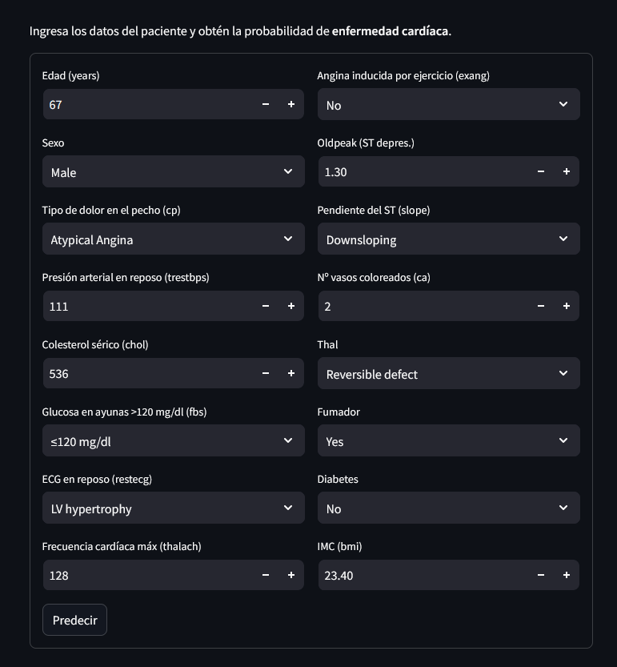
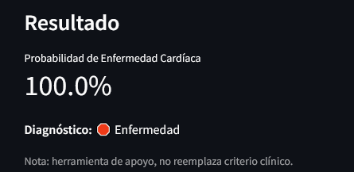

# 🫀 Heart Disease Predictor

Aplicación desarrollada en **Python** y **Streamlit** que predice la probabilidad de padecer **enfermedad cardíaca** a partir de datos clínicos.  
El modelo fue entrenado con **Machine Learning** usando un conjunto de datos real y técnicas de preprocesamiento, evaluación y optimización.

> ⚠️ **Nota importante:** Esta herramienta es de **apoyo** y **no sustituye** el criterio médico profesional.

## 🖼️ Vista previa

### 🏠 Formulario de entrada


### 📊 Ejemplo de predicción


---

## 📓 Notebook del modelo

Puedes revisar todo el flujo de análisis y entrenamiento en Google Colab:  

[](https://colab.research.google.com/drive/1uNkNtCk_kXt6TkLvwRP6hxHtHlPyqzXx#scrollTo=1lxepudAcJ1t)

---

## ⚙️ Instalación local

Clona el repositorio y ejecuta la app en tu máquina:

```bash
# Clonar el proyecto
git clone https://github.com/felipegarcia123/heart-disease-predictor.git

cd heart-disease-predictor

# Crear entorno virtual (opcional pero recomendado)
python -m venv venv

# Activar entorno virtual
# Windows:
venv\Scripts\activate
# Mac / Linux:
source venv/bin/activate

# Instalar dependencias
pip install -r requirements.txt

# Ejecutar la app
streamlit run app.py

---

## 📬 Contacto

Contáctame o revisa mi trabajo en las siguientes plataformas:

[](https://www.linkedin.com/in/juan-felipe-garc%C3%ADa-garc%C3%ADa-9a167912a/)  
[](https://github.com/felipegarcia123)  
[](mailto:garciajuanfelipe3@gmail.com)